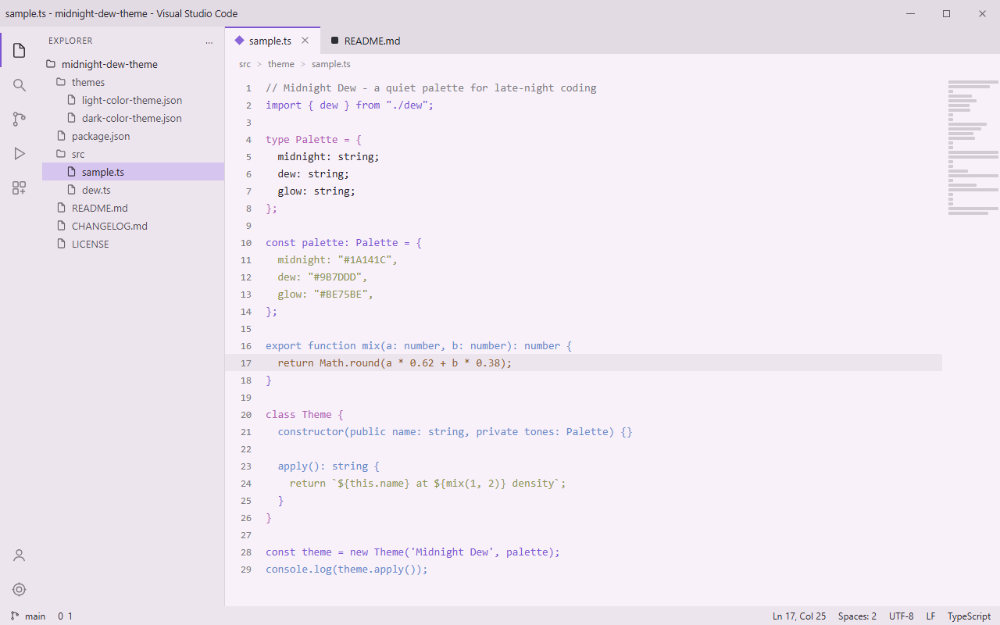
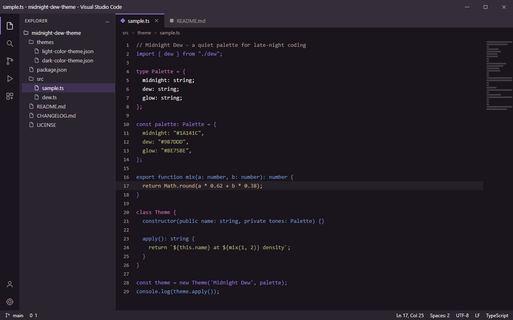

<div align="center">
  
  <h1>Midnight Dew Theme</h1>
  <p>A calm midnight purple and dew-light VS Code theme with carefully crafted light and dark variants.</p>
  <p>
    <a href="https://marketplace.visualstudio.com/items?itemName=lilinhuang.midnight-dew-theme">
      
    </a>
    <a href="https://github.com/vaxicy/midnight-dew-theme/blob/main/LICENSE">
      
    </a>
  </p>
</div>

---

## Previews

<p align="center">
  
  
</p>

The left screenshot is the light variant, the right screenshot is the dark
variant. Both keep the same quiet violet identity, so switching between them
feels like changing the light in the room rather than changing the theme.

## Introduction

Midnight Dew Theme is a soft, low-noise color theme for Visual Studio Code. It
is built around two anchor colors: a deep plum-slate that stands in for the
night, and a clean lilac violet that stands in for the dew. Everything else is
derived from those two so the workbench and the syntax palette stay in one
family instead of drifting apart.

The extension ships two selectable variants:

- **Midnight Dew Theme Light** - a bright lilac-white editor (`#F8F1FA`) with a
  soft plum foreground (`#2B252D`) and violet accents (`#7D55D3`).
- **Midnight Dew Theme Dark** - a deep plum-slate editor (`#1A141C`) with a
  warm off-white foreground (`#F8F7F6`) and luminous lilac accents (`#9B7DDD`).

## Themes

Both variants cover the full workbench: editor, activity bar, sidebar, panels,
tabs, status bar, command palette, inputs and dropdowns, lists and selections,
diffs, widgets, notifications, and the integrated terminal including all ANSI
colors. Accents are applied selectively, so the result reads calm rather than
neon.

### Midnight Dew Theme Light

The light variant keeps the editor slightly brighter than the surrounding
chrome, which makes long files feel airy while the sidebar and panels stay
visibly separated. Violet (`#7D55D3`) is reserved for focus borders, active
line numbers, badges, buttons, and the active tab indicator, while selections
use a pale lilac wash (`#D6C5EF`).

### Midnight Dew Theme Dark

The dark variant starts from a true plum-slate (`#1A141C`) instead of a neutral
gray, so the surfaces stay warm. The activity bar is the darkest surface
(`#1B151F`), the sidebar and panels sit one step up (`#2A242E`), and the lilac
accent (`#9B7DDD`) carries selection, focus, and bracket matching without
glaring against the background.

## Palette

| Role | Light | Dark | Notes |
| --- | --- | --- | --- |
| Editor background | `#F8F1FA` | `#1A141C` | main canvas |
| Editor foreground | `#2B252D` | `#F8F7F6` | body text |
| Sidebar / panel | `#ECE5EE` | `#2A242E` | chrome surfaces |
| Title bar | `#E2DBE4` | `#352E3A` | window frame |
| Activity bar | `#ECE5EE` | `#1B151F` | outermost rail |
| Accent | `#7D55D3` | `#9B7DDD` | focus, badges, active tab |
| Selection | `#D6C5EF` | `#3E3152` | selected text and lists |

## Syntax Mapping

| Token | Light | Dark |
| --- | --- | --- |
| Comments | `#817B83` (italic) | `#AB9B96` (italic) |
| Keywords / storage | `#7D55D3` | `#9B7DDD` |
| Strings | `#8F9553` | `#B0BA7D` |
| Numbers / constants | `#906231` | `#D8B48D` |
| Types / classes | `#B362B6` | `#C174BB` |
| Functions | `#688ACA` | `#759CCE` |
| Variables | `#2B252D` | `#F8F7F6` |
| Tags | `#7D55D3` | `#9B7DDD` |
| Attributes | `#906231` | `#D8B48D` |
| Invalid | `#C93650` | `#D86E81` |

## Features

- **Two matched variants** - light and dark ship together and share one palette
  family, so switching is not jarring.
- **Full workbench coverage** - editor, sidebar, activity bar, tabs, panels,
  status bar, terminal ANSI colors, diffs, and widgets.
- **Complete syntax palette** - comments, strings, numbers, keywords, types,
  functions, variables, properties, tags, attributes, and Markdown headings.
- **Readable in both moods** - comments stay quiet and italic, while keywords,
  strings, and numbers keep enough separation to scan quickly.
- **No configuration required** - install and pick a variant; nothing else to
  tune.

## Installation

1. Open the Extensions view in VS Code (`Ctrl+Shift+X` / `Cmd+Shift+X`).
2. Search for `Midnight Dew Theme`.
3. Click **Install**.

Alternatively, run the following command from the Command Palette
(`Ctrl+Shift+P` / `Cmd+Shift+P`):

```
ext install lilinhuang.midnight-dew-theme
```

## Usage

1. Open the Command Palette (`Ctrl+Shift+P` / `Cmd+Shift+P`).
2. Run **Preferences: Color Theme**.
3. Select **Midnight Dew Theme Light** or **Midnight Dew Theme Dark**.

To switch quickly, use the same command again, or bind `workbench.action.selectTheme`
to a shortcut of your choice.

## Feedback

Feedback, suggestions, and contributions are welcome. Please open an issue or
pull request on the project repository.
